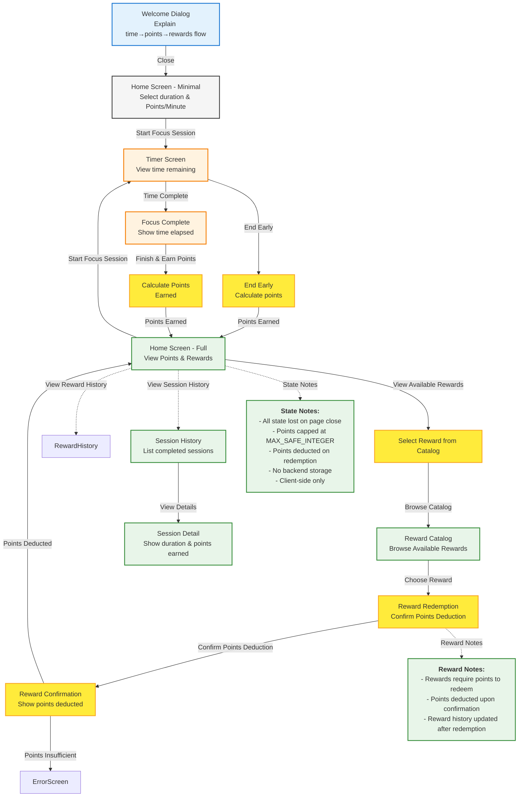

# PomoExchange Design Document

## 1. Executive Summary

PomoExchange addresses the challenge of sustaining focus in a world with increasing distractions. Existing time management tools focus on tracking time blocks, but few provide immediate, tangible rewards for maintaining focus. This creates a gap between the traditional Pomodoro technique (25-minute focus + 5-minute break) and user motivation.

Unlike passive time-tracking apps, PomoExchange replaces the passive break with active engagement to turn break time into a reward that requires focus to earn.

PomoExchange gamifies time blocking by replacing the traditional break with point-earned rewards. Users stay focused to earn points, which they can redeem for break activities like quick walks or stretches.

## 2. Requirements & Goals

### 2.1 Functional Requirements

1. Session Management
   - User can begin and end a focus session
   - User can set the length of time for the focus session
   - User can end a focus session early to gain points

2. Points Calculation
   - User receives points when ending a focus session
   - Points formula: `points = time_elapsed_minutes * points_per_minute`
   - User can set the number of points earned per minute elapsed
   - Points are capped at max numeric value supported

3. Reward System
   - User can redeem a reward using earned points
   - Reward history is visible on Home Screen after first reward redepmtion
   - Session history is viewable through Home Screen after first reward redemption

### 2.2 Non-Functional Requirements

1. User Experience
   - UI should be minimal to prevent distractions during focus session
   - Animations should guide user through key actions
   - Timer should display time remaining during session

2. Data Persistence
   - All state is lost if user loses connection or closes web app
   - Points and settings persist across sessions
   - Points overflow is handled by capping at max numeric value

3. Motivation & Engagement
   - Reward history motivates users by visually displaying redeemed rewards
   - Session history provides transparency into user progress
   - Points system creates tangible incentive for focus

### 2.3 Goals

1. Gamify time blocking by replacing passive breaks with point-earned rewards
2. Create immediate, tangible rewards for maintaining focus
3. Bridge the gap between traditional Pomodoro technique and user motivation
4. Encourage sustained focus through active engagement during break time

## 3. Architecture Overview

### 3.1 User Flow

