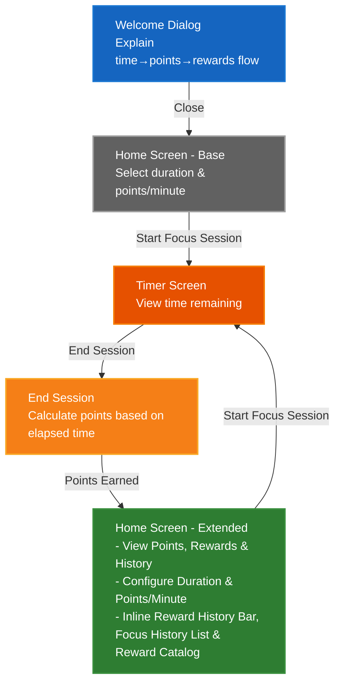

# PomoExchange Design Document

## 1. Executive Summary

PomoExchange addresses the challenge of sustaining focus in a world with increasing distractions. Existing time management tools focus on tracking time blocks, but few provide immediate, tangible rewards for maintaining focus. This creates a gap between the traditional Pomodoro technique (25-minute focus + 5-minute break) and user motivation.

Unlike passive time-tracking apps, PomoExchange replaces the mandatory break structure and gamifies time blocking with optional earned rewards to turn passive breaks into earned reward activities. Users stay focused to earn points, which they can redeem for reward activities like quick walks or stretches.

PomoExchange intentionally defaults to a tighter focus-to-reward ratio than traditional Pomodoro (4:1 vs 3.33:1), encouraging more time spent focusing while providing flexibility on when to take breaks. Rather than mandating breaks, users choose when and how to spend their earned reward time.

## 2. Requirements & Goals

### 2.1 Functional Requirements

1. Onboarding
   - Explanation of app is the first thing user sees

2. Focus Session Management
   - User can begin and end a focus session
   - User can set the length of time for the focus session
   - User can end a focus session at any time (early or at completion)
   - Points are based purely on elapsed time — no penalty for ending early, no bonus for completing
   - This gives users flexibility for real-world interruptions without creating pressure to optimize around the timer

3. Points Calculation
   - User receives points when ending a focus session
   - Points formula: `points = elapsedMinutes * pointsPerMinute`
   - Default pointsPerMinute = 0.05
   - User can set the number of points earned per minute elapsed
   - The pointsPerMinute setting persists across focus sessions within the same app session
   - Points are capped at 10,000
   - If earning points would exceed the cap, the user receives points only up to 10,000
   - User is notified before starting a focus session when at cap

4. Reward System
   - Three predefined reward tiers:
     - Small: 5 minutes (suggestions: Stretching, Get a snack, Walk around)
     - Medium: 10 minutes (suggestions: Walk outside, Quick workout, YouTube video)
     - Large: 15 minutes (suggestions: Watching half a TV show, Quick nap)
   - Each tier displays suggested duration and example activities
   - User self-selects how to reward themselves within the chosen tier
   - Reward costs:
      - Small: 1 point (20 min focus at default rate)
      - Medium: 2 points (40 min focus at default rate)
      - Large: 3 points (60 min focus at default rate)
   - User can redeem a reward using earned points
   - Unaffordable rewards are disabled/grayed out with insufficient points message
   - Focus session history for the current app session is viewable through Home Screen after first focus session
   - Reward history for the current app session is visible on Home Screen after first reward redemption

5. Intentionally default to a 4:1 focus-to-reward ratio to encourage more time spent focusing than traditional Pomodoro. Comparisons are normalized to 100 minutes of focus (equivalent to 4 traditional Pomodoros):
   - Traditional Pomodoro: 4 × 25 min = 100 min focus. Breaks = 3 × 5 min short + 1 long break (15–30 min) = 30–45 min total break → ratio 3.33:1 to 2.22:1
   - PomoExchange: 100 min focus × 0.05 pts/min = 5 points = 25 min total reward time → ratio 4:1
   
   | Approach | Focus | Break | Ratio |
   |----------|-------|-------|-------|
   | Traditional Pomodoro (15-min long break) | 100 min | 30 min | 3.33:1 |
   | Traditional Pomodoro (30-min long break) | 100 min | 45 min | 2.22:1 |
   | PomoExchange | 100 min | 25 min | 4:1 |


### 2.2 Non-Functional Requirements

1. User Experience
   - UI should be minimal to prevent distractions during focus session
   - Animations should guide user through key actions
   - Timer should display time remaining during focus session
   - Accessibility: All interactive components meet WCAG 2.1 AA standards, validated via Playwright-only automated tests with no snapshot testing (Section 7.2)

2. Data Persistence
   - All state is lost on page close/reload

3. Motivation & Engagement
   - Reward history motivates users by visually displaying redeemed rewards
   - Focus session history provides transparency into user progress
   - Points system creates tangible incentive for focus

### 2.3 Goals

1. Gamify time blocking by replacing passive breaks with point-earned rewards
2. Create immediate, tangible rewards for maintaining focus
3. Bridge the gap between traditional Pomodoro technique and user motivation
4. Encourage sustained focus through tangible, self-selected reward incentives

### 2.4 Non-Goals
1. No user accounts or authentication — no login, no profiles, no multi-user support
2. No persistent storage — all state is scoped to a single browser session; no localStorage or server-side storage
3. No social features — no sharing, leaderboards, or community challenges
4. No custom rewards — reward tiers (Small, Medium, Large) are predefined and not user-configurable
5. No calendar integrations — no syncing with Google Calendar, Outlook, or other scheduling tools
6. No push notifications or reminders — the app does not prompt users to start sessions
7. No analytics or progress tracking across sessions — no dashboards, reports, or trend visualization
8. No offline support beyond a loaded page — the app requires an initial page load and internet connection

### 2.5 Definitions
1. App Session: The period from when a user loads the page in their browser until they close the tab or navigate away. All history (focus sessions and rewards) is scoped to a single app session and is lost when the session ends.

## 3. Architecture Overview

### 3.1 User Flow



#### Notes
| Category | Details |
|----------|---------|
| **State** | All state lost on page close/reload<br/>Points deducted on redemption<br/>No backend storage<br/>Client-side only |
| **Welcome Dismissal** | WelcomeDialog dismissal is scoped to the current app session only; no cross-session persistence per Non-Goal #2. |
| **Screen States** | HomeExtended includes all HomeBase functionality (duration and pointsPerMinute configuration) plus points display, reward catalog, and focus session history; reward history appears conditionally after the first reward redemption<br/>Home screen transitions from Base to Extended after first focus session |
| **Rewards** | Rewards require points to redeem<br/>Points deducted upon confirmation<br/>Reward history updated after redemption |
| **Affordability** | Checked at catalog display<br/>Only affordable rewards selectable<br/>No error screen needed |
| **Reward History Bar** | Displayed inline on Extended Home after first reward redemption as a row of tier-differentiated shapes: Small=triangle, Medium=square, Large=pentagon. Hover (desktop) or tap (mobile) reveals redemption timestamp, tier, and points cost. Scoped to current app session only. |
| **Focus History List** | Focus session history for only the current app session |
| **History Sections** | Reward History Bar and Focus History List are inline sections of the Home Extended screen, not separate navigable views or pages. |
| **Reward Confirmation** | Triggered when selecting an affordable reward from the inline Reward Catalog. Implemented as `RewardConfirmationModal` (modal overlay on Home Screen), not a separate screen. Confirming deducts points and returns to Home Extended. |
| **Points Cap Warning** | Persistent inline warning displayed near the "Start Focus Session" button on Home Screen (Base/Extended) when `pointsBalance >= 10000`. No dismiss option; hidden automatically when points drop below 10k (via reward redemption). Informs user they will earn 0 points for focus sessions while at cap. |
| **Route Guards** | `/timer` route is protected by `ProtectedRoute` wrapper. If user navigates to `/timer` when `!isSessionActive` (e.g., direct URL access, page reload), they are automatically redirected to `/` (Home Screen). |

### 3.2 Technical Stack

| Component | Technology | Version | Rationale |
|-----------|------------|---------|-----------|
| Frontend Framework | React | TBD | Latest stable with full TypeScript support |
| Routing | React Router | TBD | Declarative routing with type safety |
| State Management | Context + useReducer | TBD | Global state for points/focus sessions without external dependencies |
| Build Tool | Vite | TBD | Fast HMR, optimized for React |
| CSS Framework | Tailwind CSS | TBD | Utility-first, consistent styling |
| Language | TypeScript | TBD | Type safety, better IDE support |
| Testing | Vitest (Browser Mode) | TBD | Fast, ESM-first, runs tests in real browsers |
| Deployment | GitHub Pages | - | Static hosting, free |

### 3.3 State Management Strategy
- Client-Only Application: All state is managed client-side without server storage
- Session State: User-configured minutes for focus session, active session start time (for elapsed time calculation), points balance, points earned per minute (persists within the current app session), reward history (for current app session only), focus session history (for current app session only)
- No backend storage

### 3.4 Design Constraints
- Client-Only Application: No backend, no API calls
- No Authentication: No user accounts, no login required
- No Server-Side Validation: All validation is client-side

## 4. Detailed Design

### 4.1 Component Hierarchy

```
App
├── HomeScreen
│   ├── WelcomeDialog (conditional: shown on initial page load of each app session per Section 2.5)
│   ├── SessionConfig (duration input, points/minute selector)
│   ├── PointsDisplay
│   ├── FocusHistorySection
│   │   ├── FocusHistoryHeader (expand/collapse toggle)
│   │   └── FocusHistoryList (collapsible)
│   │       └── FocusSessionItem
│   ├── RewardHistoryBar
│   │   └── RewardShape
│   └── RewardCatalog
│       ├── RewardTierCard (Small, Medium, Large)
│       └── RewardConfirmationModal
└── ProtectedRoute
    └── TimerScreen
        ├── TimerDisplay
        └── EndSessionButton
```

### 4.2 Component Responsibilities

| Component | Responsibility |
|-----------|---------------|
| `WelcomeDialog` | Shown once per app session (on initial page load of each app session per Section 2.5); explains time → points → rewards flow. Resets to un-dismissed on page reload/navigation away per Section 2.2 NFR #2 (no persistent storage). |
| `SessionConfig` | Duration input (minutes) and points/minute slider/input; disabled during active session. Contains "Start Focus Session" button. Conditionally renders a persistent inline cap warning near the Start button when `state.pointsBalance >= 10000`: *"You've reached the 10,000 points cap! Focus sessions will earn 0 points until you redeem rewards."* |
| `PointsDisplay` | Shows current point balance; hidden until first session completed |
| `FocusHistorySection` | Expandable section for focus history; collapsed by default |
| `FocusHistoryHeader` | Shows section title and expand/collapse toggle |
| `FocusHistoryList` | Renders list of completed focus sessions for current app session; hidden when collapsed |
| `FocusSessionItem` | Single session entry showing elapsed minutes and points earned. Requires `data-testid="focus-session-item"` and computed `aria-label="Focus session: ${elapsedMinutes} minutes, ${pointsEarned} point${pointsEarned !== 1 ? 's' : ''} earned"` (Section 7.5). Integration tests validate all session history entries. |
| `RewardHistoryBar` | Inline row of tier-differentiated shapes; hidden until first redemption |
| `RewardShape` | Triangle/square/pentagon; hover/tap reveals timestamp, tier, cost. Requires `data-testid="reward-shape"`, `data-tier={tier}` attribute, and computed `aria-label="${tier} reward (${shape})"` (shape from REWARD_TIERS per Section 3.1 Notes). |
| `RewardCatalog` | Lists three tiers; disables unaffordable rewards |
| `RewardTierCard` | Displays tier name, duration, cost, example activities |
| `RewardConfirmationModal` | Shows cost and asks for confirmation before deducting points |
| `TimerScreen` | Displays countdown timer; handles session end |
| `TimerDisplay` | Large time-remaining display with visual progress indicator. Requires `data-testid="timer-display"` and computed `aria-label="Time remaining: ${mm}:${ss}"` (Section 7.5). No elapsed time/decrease checks in tests per user clarification. |
| `EndSessionButton` | Ends session early or at completion; triggers points calculation |
| `ProtectedRoute` | Wrapper component that reads `isSessionActive` from `AppStateContext`. If `true`, renders child component (`TimerScreen`). If `false`, redirects to `/` (Home Screen) via React Router `Navigate` component. |

### 4.3 Data Types

```typescript
type RewardTier = 'small' | 'medium' | 'large';

interface FocusSession {
  id: string;
  elapsedMinutes: number;
  pointsEarned: number;
  endedAt: Date;
}

interface RewardRedemption {
  id: string;
  tier: RewardTier;
  pointsCost: number;
  redeemedAt: Date;
}

interface AppState {
  pointsBalance: number;
  focusSessions: FocusSession[];
  rewardHistory: RewardRedemption[];
  isSessionActive: boolean;
  sessionStartTime: Date | null;
  sessionConfig: {
    durationMinutes: number;
    pointsPerMinute: number;
  };
  welcomeDismissed: boolean;
}

const POINTS_CAP = 10000;
const DEFAULT_POINTS_PER_MINUTE = 0.05;

const REWARD_TIERS = {
  small:  { duration: 5,  cost: 1, suggestions: ['Stretching', 'Get a snack', 'Walk around'] },
  medium: { duration: 10, cost: 2, suggestions: ['Walk outside', 'Quick workout', 'YouTube video'] },
  large:  { duration: 15, cost: 3, suggestions: ['Watching half a TV show', 'Quick nap'] },
} as const;
```

### 4.4 State Management

**Context structure:**

```typescript
interface AppStateContextValue {
  state: AppState;
  dispatch: React.Dispatch<AppAction>;
}

type AppAction =
  | { type: 'DISMISS_WELCOME' }
  | { type: 'SET_DURATION'; payload: number }
  | { type: 'SET_POINTS_PER_MINUTE'; payload: number }
  | { type: 'START_SESSION'; payload?: { startTime?: Date } }
  | { type: 'END_SESSION'; payload?: { endTime?: Date } }
  | { type: 'REDEEM_REWARD'; payload: { tier: RewardTier } };
```

**Initial state:**

```typescript
const initialState: AppState = {
  pointsBalance: 0,
  focusSessions: [],
  rewardHistory: [],
  isSessionActive: false,
  sessionStartTime: null,
  sessionConfig: {
    durationMinutes: 25,
    pointsPerMinute: 0.05,
  },
  welcomeDismissed: false,
};
```

**Reducer cases:**
- `DISMISS_WELCOME`: Sets `welcomeDismissed: true` for the current app session; resets to false on page reload (new app session) due to no persistent storage (Section 2.4 Non-Goal #2).
- `SET_DURATION`: Updates `sessionConfig.durationMinutes`; ignored if `isSessionActive: true`
- `SET_POINTS_PER_MINUTE`: Updates `sessionConfig.pointsPerMinute`; ignored if `isSessionActive: true`
- `START_SESSION`: Sets `isSessionActive: true`, `sessionStartTime: action.payload?.startTime ?? new Date()`
- `END_SESSION`: Extracts `endTime = action.payload?.endTime ?? new Date()`. Calculates `elapsedMinutes` as `(endTime.getTime() - state.sessionStartTime!.getTime()) / 60000` (retain fractional values, uses `calculateElapsedMinutes` helper from Section 4.6). Calculates `pointsEarned` as `elapsedMinutes * state.sessionConfig.pointsPerMinute`, capped to ensure `state.pointsBalance + pointsEarned` does not exceed `POINTS_CAP` (10,000) per Section 2.1. Appends new `FocusSession` entry with `elapsedMinutes` set to the calculated value and `pointsEarned` set to the capped value. Sets `isSessionActive: false`, `sessionStartTime: null`. (Matches Section 4.6 algorithm)
- `REDEEM_REWARD`: Checks affordability, deducts points, appends to `rewardHistory`

### 4.5 Screen Layouts

**Home Screen (Base):**
- Centered vertically
- Duration input field
- Points/minute input
- "Start Focus Session" button
- Persistent inline points cap warning (displayed near Start Focus Session button when pointsBalance >= 10000)

**Home Screen (Extended):**
- Points balance at top
- Duration and points/minute config (same as Base)
- "Start Focus Session" button
- Persistent inline points cap warning (displayed near Start Focus Session button when pointsBalance >= 10000)
- Reward history bar (conditional, after first redemption)
- Reward catalog section (responsive: 3-column grid on desktop, single column on mobile; suggestions shown on tap on mobile)
- Focus history list at bottom (collapsible, collapsed by default): shows each session's elapsed minutes and points earned

**Timer Screen:**
- Full-screen layout
- Large countdown timer (MM:SS)
- Visual progress ring or bar
- "End Session" button

### 4.6 Key Algorithms

**Points calculation:**
```
pointsEarned = min(elapsedMinutes * state.sessionConfig.pointsPerMinute, POINTS_CAP - state.pointsBalance)
```
- No bonus for completing full duration
- No penalty for ending early
- Capped at 10,000 total points

**Elapsed minutes calculation (pure helper function):**
```typescript
function calculateElapsedMinutes(startTime: Date, endTime: Date): number {
  return (endTime.getTime() - startTime.getTime()) / 60000;
}
```
- Used by `END_SESSION` reducer case
- Retains fractional values (e.g., 30 seconds = 0.5 minutes)
- Testable in isolation without system time dependencies

**Reward affordability check:**
```
isAffordable = state.pointsBalance >= REWARD_TIERS[tier].cost
```
- Unaffordable rewards are grayed out with "Need X more points" message

### 4.7 Routing

| Route | Component | Notes |
|-------|-----------|-------|
| `/` | HomeScreen | Default route; shows WelcomeDialog on initial page load of each app session per Section 2.5; dismissed state resets on page reload per Section 2.2 NFR #2 |
| `/timer` | ProtectedRoute → TimerScreen | Active focus session only; wrapped with `ProtectedRoute` that redirects to `/` if `!isSessionActive` |

## 5. Alternatives Considered
I evaluated the following alternatives to the chosen design and technical decisions, weighing tradeoffs against the project's stated goals (Section 2.3) and non-goals (Section 2.4).

### 5.1 Technical Stack Alternatives
| Decision Area | Alternative | Pros | Cons | Rejected Because |
|---------------|-------------|------|------|------------------|
| State Management | Zustand / Redux Toolkit | Scalable for large apps, built-in devtools | Overkill for small client-only state scope, adds external dependencies | Context + useReducer handles points, sessions, and rewards with no third-party libraries |
| CSS Framework | CSS Modules / styled-components | Scoped styles, no utility class learning curve | More boilerplate for responsive design, less consistent cross-component styling | Tailwind's utility-first approach supports rapid, minimal UI development |
| Build Tool | Create React App (CRA) | Familiar to many React developers | Deprecated, no longer maintained, slower HMR than Vite | Vite offers faster development experience and better ESM support |
| Deployment | Vercel / Netlify | Built-in CI/CD, additional deployment features | Requires account setup, GitHub Pages meets all static hosting needs | No need for extra features, GitHub Pages is free and integrated with the repo |

### 5.2 Product Design Alternatives
| Decision Area | Alternative | Pros | Cons | Rejected Because |
|---------------|-------------|------|------|------------------|
| State Persistence | localStorage for cross-session history | Users retain progress across page reloads/closes | Triggers privacy compliance requirements for persistent client-side storage, violates Non-Goal #2 (no persistent storage), adds session cleanup complexity | Avoids privacy compliance overhead; all state is explicitly scoped to a single app session |
| Reward Structure | User-customizable reward tiers | More personalization for end users | Violates Non-Goal #4, adds UI complexity for custom tier creation; without cross-session state persistence, users lose custom rewards on page reload and must re-specify them each app session | Predefined tiers simplify onboarding, align with "immediate tangible rewards" goal, and avoid forcing users to re-enter custom rewards every app session due to no persistent storage |
| Points System | Bonus points for full session completion, penalty for early end | Encourages completing 25-minute blocks | Creates timer optimization pressure, violates FR2 (flexibility for interruptions) | Linear points system prioritizes user flexibility over rigid session rules |
| Focus-to-Reward Ratio | Traditional Pomodoro 3.33:1 (100min focus / 30min break for 4 Pomodoros including long break) | Familiar to existing Pomodoro users | Passive mandatory breaks instead of earned rewards, less incentive for sustained focus | Project goal is to encourage longer focus sessions via 4:1 earned reward ratio |
| Authentication | Optional user accounts for cross-device sync | Cross-device progress tracking | Violates Non-Goal #1, requires backend/storage infrastructure | App is explicitly client-only with no backend or user accounts |
| Reward Redemption | No points deduction (unlimited redemptions) | Higher initial user engagement | Breaks earn-spend gamification loop, no incentive to earn more points | Points deduction is critical to the core gamification value proposition |

## 6. Implementation Plan

### 6.1 TDD Approach
This plan follows Test-Driven Development (TDD) principles with a mandatory red-green-refactor cycle for all feature work:
1. **Red**: Write failing unit/component tests for the target functionality first
2. **Green**: Implement minimal code to make tests pass
3. **Refactor**: Clean up code while keeping tests passing
No batched testing phase: tests are written alongside corresponding feature code, not deferred to the end of the project.

### 6.2 Timeline & Milestones
| Milestone | Description | Estimated Duration | Dependencies |
|-----------|-------------|-------------------|--------------|
| M1: Project Scaffolding & Test Setup | Initialize React Router + TypeScript project (scaffolded via `create-react-router`, uses Vite under the hood), configure Tailwind CSS, set up Vitest browser mode, create base folder structure per Component Hierarchy (Section 4.1), define core types (Section 4.3) | 2-3 days | None |
| M2: Core Focus Session Logic (TDD) | Write tests first for state reducer, points calculation, session lifecycle; implement TimerScreen, SessionConfig, ProtectedRoute to pass tests | 4-5 days | M1 |
| M3: Points & Reward System (TDD) | Write tests first for reward redemption, affordability checks, history components; implement PointsDisplay, RewardCatalog, RewardHistoryBar, FocusHistorySection to pass tests | 4-5 days | M2 |
| M4: Onboarding & UI Polish (TDD) | Write tests first for WelcomeDialog, responsive layouts, animations; implement UI polish to pass tests | 3-4 days | M3 |
| M5: Deployment & Final QA | Run full test suite, configure GitHub Pages deployment, perform cross-browser/device QA, verify all requirements met | 2-3 days | M4 |

### 6.3 Build Phase Details
#### M1: Project Scaffolding & Test Setup
- Scaffold project with `npx create-react-router@latest` (select TypeScript and Vite options when prompted)
- Install dependencies: `tailwindcss`, `postcss`, `autoprefixer`, `@axe-core/playwright`
- Set up Vitest browser mode: Run `npx vitest init browser` (automatically installs `@vitest/browser`, Playwright browser provider, and configures `vitest.config.ts` for browser-mode testing)
- Configure Vitest to output lcov coverage format for Codecov compatibility in `vitest.config.ts`
- Define core types (`AppState`, `AppAction`, `FocusSession`, `RewardRedemption`) per Section4.3, 4.4
- Create folder structure: `src/components/`, `src/context/`, `src/routes/`, `src/__tests__/`
- Add npm scripts to `package.json`: `test`, `test:integration`, `test:perf` (per Section 7.3)
- Write initial smoke tests to verify project setup (React renders, router works) using Vitest browser mode

#### M2: Core Focus Session Logic (TDD)
TDD cycle for each sub-task:
1. **Reducer & State Logic**
   - Red: Write failing tests for `AppStateContext` reducer cases: `START_SESSION`, `END_SESSION`, points calculation (Section 4.4, 4.6), points cap logic
   - Green: Implement reducer and context to pass all tests
   - Refactor: Optimize state logic if needed, keep tests passing
2. **Timer & Session Components**
   - Red: Write failing Vitest browser mode component tests for `TimerScreen`, `TimerDisplay`, `EndSessionButton`, `ProtectedRoute` (Section 4.1, 4.2, 4.7)
   - Green: Implement components to pass tests
   - Refactor: Clean up component code, keep tests passing
3. **Session Config**
   - Red: Write failing tests for `SessionConfig` input handling, points cap warning (Section 4.2, 4.5)
   - Green: Implement `SessionConfig` to pass tests
   - Refactor: Clean up as needed

#### M3: Points & Reward System (TDD)
TDD cycle for each sub-task:
1. **Points & History Display**
   - Red: Write failing Vitest browser mode tests for `PointsDisplay`, `FocusHistorySection`, `FocusSessionItem` (Section 4.2)
   - Green: Implement components to pass tests
   - Refactor: Clean up as needed
2. **Reward System**
   - Red: Write failing Vitest browser mode tests for `RewardCatalog`, `RewardTierCard`, affordability checks (Section 4.2, 4.6), `RewardConfirmationModal` points deduction
   - Green: Implement components to pass tests
   - Refactor: Clean up as needed
3. **Reward History**
   - Red: Write failing Vitest browser mode tests for `RewardHistoryBar`, `RewardShape` interactions (Section 4.2)
   - Green: Implement components to pass tests
   - Refactor: Clean up as needed

#### M4: Onboarding & UI Polish (TDD)
TDD cycle for each sub-task:
1. **Onboarding**
   - Red: Write failing Vitest browser mode tests for `WelcomeDialog` rendering, dismiss logic (Section 4.2)
   - Green: Implement `WelcomeDialog` to pass tests
   - Refactor: Clean up as needed
2. **Responsive & UI Polish**
   - Red: Write failing Vitest browser mode tests for responsive reward grid (Section 4.5), minimal animations, distraction-free `TimerScreen` (Section 2.2 NFR)
   - Green: Implement UI polish to pass tests
   - Refactor: Clean up as needed

#### M5: Deployment & Final QA
- Run full Vitest test suite, verify 100% line/branch coverage for all in-scope code (excluding static presentational UI); validate 100% user flow logic path coverage and basic UI rendering checks in integration tests
- Configure GitHub Pages deployment via `vite.config.ts` base path
- Perform cross-browser/device QA (latest Chrome, Firefox, Safari desktop/mobile)
- Verify all Functional Requirements (Section 2.1) and Non-Functional Requirements (Section 2.2) are met
- No new test writing in this phase; only validate existing tests and deployment

### 6.4 Dependencies & Risks
- **TBD Tech Versions**: Finalize React, React Router, Tailwind, Vitest versions (marked TBD in Section 3.2) before M1 to avoid compatibility issues
- **No Backend**: All state is client-side only (Section 2.4 Non-Goal #2), no external state dependencies
- **Browser Compatibility**: Validate Tailwind, React, and Vitest browser mode features work on target browsers (latest version of major browsers)
- **TDD Adoption**: Strictly follow red-green-refactor cycle; avoid skipping tests for UI components

### 6.5 Success Criteria
- TDD red-green-refactor cycle followed for all feature milestones (M2-M4)
- All Functional Requirements (Section 2.1) implemented and verified via tests
- All Non-Functional Requirements (Section 2.2) met
- ~90% line/branch coverage for Tier 3 (business logic) code; 100% user flow logic path coverage. Integration tests include basic UI rendering checks for all displayed UI components.
- Coverage uploaded to Codecov on every push/PR, meeting ~90% Tier 3 line/branch coverage target (Section 7.4)
- All test suites pass in GitHub Actions CI on every push/PR
- Successful production build with no console errors/warnings
- Public GitHub Pages deployment passes all QA checks
- No standalone testing phase; all tests written alongside corresponding feature code

## 7. Testing
This section defines the testing strategy, tooling, scope, and validation criteria for PomoExchange, complementing the TDD methodology outlined in Section 6.1. All testing aligns with the project's Functional Requirements (Section 2.1), Non-Functional Requirements (Section 2.2), and Technical Stack (Section 3.2).

### 7.1 Testing Scope

Components are classified into three tiers based on testing needs:

| Tier | Criteria | Testing Approach | Examples |
|------|----------|------------------|----------|
| **Tier 1: Pure Presentational** | No business logic, no data transformation, no user interactions, no state changes | **No tests** (excluded entirely) | Simple icon components, static divs with Tailwind classes |
| **Tier 2: Data Display** | Renders data passed via props, has `data-testid`/`aria-label` for accessibility, no user interactions or state changes | **Integration tests ONLY** — verify rendering + data accuracy in flow tests; no dedicated component tests | `TimerDisplay`, `RewardShape`, `FocusSessionItem` |
| **Tier 3: Business Logic** | Contains user interactions, conditional rendering based on state, calculations, or route protection | **Full testing** — unit/component tests + integration tests | `RewardCatalog`, `SessionConfig`, `ProtectedRoute`, reducer |

#### Classified Components (Section 4.2):
- **Tier 2 (Integration only)**: `TimerDisplay`, `FocusSessionItem`
  - Integration tests verify: presence during flows, correct data display (time format, session data)
  - No dedicated `*.test.tsx` files for these components
- **Tier 3 (Full testing)**: `RewardCatalog`, `SessionConfig`, `ProtectedRoute`, `WelcomeDialog`, `RewardConfirmationModal`, `RewardShape`, reducer
  - Full test coverage including dedicated component tests
  - *Timer drift edge cases (background tab throttling, system sleep, setInterval drift) are explicitly excluded per user request.*
- **Tier 1 (No tests)**: Pure Tailwind-styled divs, simple icons with no logic

> **Coverage impact**: Tier 2 components are excluded from the ~90% coverage target. Only Tier 3 code counts toward coverage metrics.

### 7.2 Test Types
All test types use Vitest (Browser Mode) per Section 3.2, with Playwright as the browser provider (configured in M1, Section 6.3):

| Test Type | Target | Scope | Mobile Testing Scope | File Location |
|-----------|--------|-------|---------------------|---------------|
| Unit Tests | Tier 3: Reducer logic (`AppStateContext` cases), points calculation (Section 4.6), affordability checks | Isolated logic, no React rendering | Not applicable (no UI) | `src/context/*.test.ts` |
| Component Tests | Tier 3: UI components with business logic (rendering, user interactions, state-driven conditional rendering) | Single component, mocked context/router. Accessibility: Use Playwright `page` object via Vitest Browser Mode → `injectAxe(page)` → `runAxe(page)` → assert `violations.length === 0` (no snapshots) | Use `page.setViewportSize({ width: 390, height: 844 })` (iPhone 12 baseline) to test mobile interactions (tap, responsive layout) for `RewardCatalog`, `WelcomeDialog` | `src/components/**/*.test.tsx` |
| Integration Tests | Tier 2 + Tier 3: End-to-end user flow logic paths, multi-component chains, route protection. Includes Tier 2 data display validation | Full app state, real context/router, no isolated single-component tests. Accessibility: Run `runAxe(page)` at key flow states → assert 0 violations (no snapshots) | Run full user flows in mobile viewport (`page.setViewportSize({ width: 390, height: 844 })`) to validate end-to-end mobile behavior (onboarding, reward redemption) | `src/__tests__/` |
| Performance Tests | Tier 3: Reducer benchmarks, large-state rendering thresholds | Benchmark metrics, CI automatic runs | Not applicable | `src/__tests__/performance.test.ts` |
| Smoke Tests | Initial project setup validation (router functionality, base renders) | Minimal sanity checks | Verify base renders in mobile viewport | `src/__tests__/` |

> **Flaky Test Flagging**: Browser-based rendering performance tests are marked with `@flaky` tag and use Vitest retry (max 2 attempts) in CI. Stable unit benchmarks require no retries.

> **Accessibility Testing**: Uses `@axe-core/playwright` exclusively (no jest-axe). Snapshot testing is prohibited: no Playwright `page.accessibility.snapshot()` and no Vitest `toMatchSnapshot()`.

#### Exclusive Scope Principle
No behavior is tested in both component and integration suites:
- **Component tests**: Isolated single Tier 3 component with mocked deps
- **Integration tests**: Multi-component user flows with full app state

```markdown
Decision Tree for Test Placement:
Test for single Tier 3 component isolated behavior?
├─ Yes → Component test with mocked deps
└─ No → Test for multi-component user flow?
   ├─ Yes → Integration test with full app render
   └─ No → Reevaluate need for test
```

### 7.3 Test Configuration
- Matches TDD cycle (Section 6.1): Tests are written before implementation, enforced red-green-refactor for all milestones M2-M4.
- File structure (defined in M1, Section 6.3):
  - `src/context/*.test.ts` for reducer/state logic unit tests (Tier 3)
  - `src/components/**/*.test.tsx` for Tier 3 component tests only (no test files for Tier 1 or Tier 2 components)
  - `src/__tests__/performance.test.ts` for performance tests
  - `src/__tests__/` for integration and smoke tests
- **Accessibility Testing**: Add `@axe-core/playwright` dependency (M1, Section 6.3). All a11y checks use Playwright `runAxe(page)` → assert `violations.length === 0`. **Snapshot testing is prohibited**: no Playwright `page.accessibility.snapshot()` and no Vitest `toMatchSnapshot()`.
- **Mobile Testing**: Uses Playwright `page.setViewportSize()` in Vitest Browser Mode; standard mobile viewport baseline: `{ width: 390, height: 844 }` (iPhone 12). No separate mobile test runner. Snapshot testing is prohibited for mobile layouts.
- **Naming conventions**: Test files must match their tier scope:
  - Component tests: `ComponentName.test.tsx` (tests single component only)
  - Integration tests: `flow-name.test.ts` (tests multi-component flows)
- **TDD review check**: During code review, verify no duplicate behavior coverage between component and integration test suites for the same feature.
- **CI Configuration**: All test suites run automatically on all push/PR events in GitHub Actions:
  - Unit + Component tests: `npm run test` (runs `src/context/*.test.ts` + `src/components/**/*.test.tsx` with lcov coverage)
  - Integration tests: `npm run test:integration` (runs `src/__tests__/` excluding performance tests)
  - Performance tests: `npm run test:perf` (existing, runs `src/__tests__/performance.test.ts` with no coverage)
  - Coverage uploaded to Codecov via `codecov/codecov-action@v4`; fallback artifacts uploaded to GitHub Actions.
  - Playwright browsers installed via `npx playwright install --with-deps` in CI.
- **Flaky Test Handling**: Tests tagged `@flaky` use Vitest config `retry: 2` in CI environments only.
- Coverage reporting via Vitest `--coverage` flag, integrated into M5 Final QA (Section 6.3).

### 7.4 Coverage Requirements
Per Section 6.5 Success Criteria:
- ~90% line/branch coverage for Tier 3 (business logic) code, including edge case and performance tests; Tier 2 components are excluded from coverage metrics
- 100% branch coverage for all user flow logic paths defined in Section 3.1 User Flow diagram
- Coverage exclusions: Third-party dependencies, type definitions, build configuration, Tier 1 (Pure Presentational) and Tier 2 (Data Display) components

### 7.5 Example Test Cases
Maps to key Functional Requirements (Section 2.1). Test placement follows the Decision Tree in Section 7.2.

**Tier 3 - Component Tests** (`src/components/**/*.test.tsx`):
1. **Reducer Unit Tests**
   - Verify `END_SESSION` action calculates `pointsEarned` correctly, enforces 10,000 points cap (FR3)
   - Verify `REDEEM_REWARD` deducts points only if affordable, appends entry to `rewardHistory` (FR4)
   - Verify `START_SESSION` sets `isSessionActive: true` and `sessionStartTime` to current Date (FR2)
   - **`calculateElapsedMinutes` helper tests** (pure function, deterministic):
     - 25-minute session: `startTime = new Date('2026-05-06T10:00:00Z')`, `endTime = new Date('2026-05-06T10:25:00Z')` → returns 25
     - Fractional minutes: 30-second session → returns 0.5
     - 0 elapsed minutes: `startTime === endTime` → returns 0
     - Negative time (invalid input): `endTime < startTime` → returns negative value (reducer handles as 0 elapsed)
2. **Component Tests (Vitest Browser Mode)**
    - `RewardCatalog`: Verify unaffordable tiers are grayed out with "Need X more points" message (FR4). Accessibility: Run `runAxe(page)` → assert 0 violations.
    - `ProtectedRoute`: Verify redirect to `/` when `!isSessionActive` (Section 4.7). Accessibility: Run `runAxe(page)` on redirect → assert 0 violations.
    - `SessionConfig`: Verify points cap warning displays when `pointsBalance >= 10000` (FR3). Accessibility: Run `runAxe(page)` → assert 0 violations.
    - `WelcomeDialog`: Verify renders on initial app session load; hidden after dismiss click, `welcomeDismissed=true`; no re-render after dismiss within same session; resets on page reload (new app session). Accessibility: Run `runAxe(page)` when open → assert 0 violations; validate dismiss button accessible name via `page.getAttribute('[role="button"]', 'aria-label')`.
    - `RewardConfirmationModal`: Verify renders when selecting affordable reward; deducts points on confirm. Accessibility: Run `runAxe(page)` when open → assert 0 violations; verify focus trap stays in modal.
    - `RewardShape`: Verify hover reveals redemption details (timestamp, tier, cost), tap interaction on mobile, correct `data-testid="reward-shape"` and `aria-label` attributes (Section 4.2). Accessibility: Run `runAxe(page)` in default/hover states → assert 0 violations.
    - **Mobile-Specific Component Tests (Tier 3)**:
      - `RewardCatalog` (mobile): Set viewport to 390x844 → verify grid switches from 3-column to single-column (assert Tailwind `grid-cols-1` class or computed style); tap reward tier card → verify suggestions display (no hover trigger); tap again → verify suggestions hide.
      - `WelcomeDialog` (mobile): Set viewport to 390x844 → verify no horizontal overflow (assert `document.body.scrollWidth <= 390`); verify dismiss button meets WCAG touch target size (≥44x44px via `getBoundingClientRect()`); verify text content is not truncated (assert element `scrollWidth === offsetWidth`).

**Edge Case Tests (Tier 3 - Unit/Component)**:
- Verify `END_SESSION` awards 0 points when `pointsBalance = 10000` (FR3) — use fixed 25-minute session via payload times
- Verify `END_SESSION` caps points earned if `pointsBalance + pointsEarned > 10000` (e.g., 9999 + 2 = capped to 10000) (FR3) — use payload times to generate known `pointsEarned`
- Verify `END_SESSION` handles 0 elapsed minutes (empty session) (FR2) — use identical start/end times in payload
- Verify `REDEEM_REWARD` deducts points correctly when `pointsBalance = tier.cost` (FR4)
- Verify `END_SESSION` awards 0 points when `pointsPerMinute = 0` (FR3) — use fixed payload times, validate `pointsEarned = 0`
- Verify `END_SESSION` handles fractional minutes (e.g., 30-second session → 0.5 min × 0.05 = 0.025 points) — use payload times 30 seconds apart
- Verify `ProtectedRoute` redirects to `/` on direct `/timer` URL access with no active session (Section 4.7)
- Verify rapid start/end session clicks do not cause race conditions (SessionConfig button disable logic) (Section 4.2)

**Performance Tests (Tier 3, Integration/Unit)**:
   - **Stable (no retry needed)**: Reducer processes 100+ focus sessions + 50+ redemptions in <50ms (unit benchmark)
   - **Stable (no retry needed)**: Points calculation for 120-minute session completes in <10ms (unit benchmark)
   - **@flaky (2 retries in CI)**: `FocusHistoryList` renders 100+ entries in <100ms (browser performance API)
   - **@flaky (2 retries in CI)**: `RewardHistoryBar` renders 50+ shapes in <50ms (browser performance API)

**Tier 2 - Integration Tests Only** (`src/__tests__/`):
3. **Integration Tests** (Multi-component flows with full app state)
    - Full focus session flow: Verify `TimerScreen`, `TimerDisplay`, `EndSessionButton` are rendered during active session (Section 3.1). Accessibility: Run `runAxe(page)` on Home Screen (Base/Extended) and Timer Screen → assert 0 violations. **Deterministic timing**: Use Vitest fake timers (`vi.useFakeTimers()`) to set start time, advance by exact duration, dispatch actions with fixed payload times.
    - Reward redemption flow: Verify `RewardConfirmationModal` renders when selecting an affordable reward (Section 3.1). Accessibility: Run `runAxe(page)` after modal opens → assert 0 violations.
    - **FocusSessionItem** (Tier 2): Validate all session history entries display correct elapsed minutes and points earned, matching `AppState.focusSessions` order (Section 4.2, 4.3). Validate `aria-label` format via `page.getAttribute('[data-testid="focus-session-item"]', 'aria-label')` (per Exclusive Scope Principle: no `runAxe()` here, covered in component tests if reclassified).
    - **TimerDisplay** (Tier 2): Verify initial time matches configured duration in `MM:SS` format; no elapsed time/decrease checks per user clarification (Section 4.2). Validate `aria-label="Time remaining: ${mm}:${ss}"` via `page.getAttribute('[data-testid="timer-display"]', 'aria-label')`.
    - **RewardShape** (Tier 3): Verify presence in `RewardHistoryBar` during redemption flows; attribute validation covered in component tests per Exclusive Scope Principle (Section 4.2, 7.2). Validate `data-tier` attribute via `page.getAttribute('[data-testid="reward-shape"]', 'data-tier')`.
    - **Mobile Viewport Integration Tests** (390x844):
      - Onboarding flow (mobile): Set viewport to 390x844 → verify `WelcomeDialog` renders correctly, dismiss works, redirects to Home Screen Base.
      - Reward redemption flow (mobile): Set viewport to 390x844 → tap affordable reward tier → verify `RewardConfirmationModal` opens (tap trigger, no click hover).

**Deterministic Timing Strategy for Tests**:
- **Unit/Reducer tests**: Use fixed payload times in `START_SESSION` and `END_SESSION` actions (e.g., `new Date('2026-05-06T10:00:00Z')`, `new Date('2026-05-06T10:25:00Z')`) to calculate exact `elapsedMinutes`.
- **Integration tests**: Use Vitest fake timers:
  ```typescript
  vi.useFakeTimers();
  vi.setSystemTime(new Date('2026-05-06T10:00:00Z'));
  dispatch({ type: 'START_SESSION' }); // sessionStartTime = 10:00:00Z
  vi.advanceTimersByTime(25 * 60 * 1000); // Advance 25 minutes
  dispatch({ type: 'END_SESSION' }); // endTime = 10:25:00Z
  vi.useRealTimers();
  ```
- **Production code**: Optional payloads default to `new Date()`, so no behavior change for end users.

**Excluded (Tier 1 - No Tests)**:
4. **No Tests**: Pure presentational components with no data display requirements (simple icons, static divs)

*All timer drift scenarios (background tab throttling, system sleep, setInterval drift) are excluded from testing per user request.*

### 7.6 Validation & QA
- Complements M5 (Section 6.2): Full test suite run, cross-browser validation (latest Chrome, Firefox, Safari desktop/mobile)
- Manual QA: Verify all Non-Functional Requirements (Section 2.2): minimal Timer Screen UI, no persistent state across page reloads
- Regression testing: All tests re-run after each milestone; no new test writing in M5 (Section 6.3)

#### Flaky Test Registry
| Flaky Test | Reason for Flakiness | Mitigation |
|------------|----------------------|------------|
| `FocusHistoryList` 100+ entry render | Variable browser rendering times across CI runs | `@flaky` tag, max 2 retries in CI |
| `RewardHistoryBar` 50+ shape render | Variable browser rendering times across CI runs | `@flaky` tag, max 2 retries in CI |
