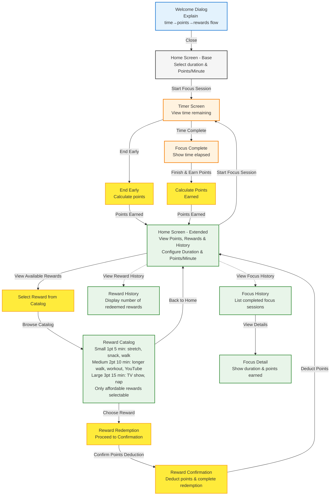

# PomoExchange Design Document

## 1. Executive Summary

PomoExchange addresses the challenge of sustaining focus in a world with increasing distractions. Existing time management tools focus on tracking time blocks, but few provide immediate, tangible rewards for maintaining focus. This creates a gap between the traditional Pomodoro technique (25-minute focus + 5-minute break) and user motivation.

Unlike passive time-tracking apps, PomoExchange replaces the passive break with earned rewards to turn break time into something users must focus to unlock.

PomoExchange gamifies time blocking by replacing the traditional break with point-earned rewards. Users stay focused to earn points, which they can redeem for break activities like quick walks or stretches.

## 2. Requirements & Goals

### 2.1 Functional Requirements

1. Onboarding
   - Explanation of app is the first thing user sees

2. Focus Session Management
   - User can begin and end a focus session
   - User can set the length of time for the focus session
   - User can end a focus session early and still gain points
   - User can wait until the focus session is complete to end it and gain points

3. Points Calculation
   - User receives points when ending a focus session
   - Points formula: `points = time_elapsed_minutes * points_per_minute`
   - Default points_per_minute = 0.05
   - User can set the number of points earned per minute elapsed
   - Points are capped at 10,000

4. Reward System
   - Three predefined reward tiers:
     - Small: 5 minutes (suggestions: stretching, getting a snack, getting up and walking around)
     - Medium: 10 minutes (suggestions: walking outside, a quick workout, a short YouTube video)
     - Large: 15 minutes (suggestions: watching half a TV show, a quick nap)
   - Each tier displays suggested duration and example activities
   - User self-selects how to reward themselves within the chosen tier
   - Reward costs:
      - Small: 1 point (20 min focus at default rate)
      - Medium: 2 points (40 min focus at default rate)
      - Large: 3 points (60 min focus at default rate)
   - User can redeem a reward using earned points
   - Insufficient rewards are disabled/grayed out with insufficient points message
   - User cannot select a reward they don't have enough points for
   - Focus session history for the current app session is viewable through Home Screen after first focus session
   - Reward history for the current app session is visible on Home Screen after first reward redemption

### 2.2 Non-Functional Requirements

1. User Experience
   - UI should be minimal to prevent distractions during focus session
   - Animations should guide user through key actions
   - Timer should display time remaining during focus session

2. Data Persistence
   - All state is lost on page close
   - Points overflow is handled by capping at 10,000

3. Motivation & Engagement
   - Reward history motivates users by visually displaying redeemed rewards
   - Focus session history provides transparency into user progress
   - Points system creates tangible incentive for focus

### 2.3 Goals

1. Gamify time blocking by replacing passive breaks with point-earned rewards
2. Create immediate, tangible rewards for maintaining focus
3. Bridge the gap between traditional Pomodoro technique and user motivation
4. Encourage sustained focus through tangible, self-selected reward incentives

## 3. Architecture Overview

### 3.1 User Flow

#### Notes
| Category | Details |
|----------|---------|
| **State** | All state lost on page close Points capped at 10,000 Points deducted on redemption No backend storage Client-side only |
| **Screen States** | HomeExtended includes all HomeBase functionality (duration and points_per_minute configuration) plus points display, reward catalog, and session history Home screen transitions from Base to Extended after first focus session |
| **Rewards** | Rewards require points to redeem Points deducted upon confirmation Reward history updated after redemption |
| **Affordability** | Checked at catalog display Only affordable rewards selectable No error screen needed |
| **Reward History** | Reward history for only the current app session |
| **Focus History** | Focus session history for only the current app session |

### 3.2 Technical Stack

| Component | Technology | Version | Rationale |
|-----------|------------|---------|-----------|
| Frontend Framework | React | TBD | Latest stable with full TypeScript support |
| Routing | React Router | TBD | Declarative routing with type safety |
| State Management | Context + useReducer | TBD | Global state for points/focus sessions without external dependencies |
| Build Tool | Vite | TBD | Fast HMR, optimized for React |
| CSS Framework | Tailwind CSS | TBD | Utility-first, consistent styling |
| Language | TypeScript | TBD | Type safety, better IDE support |
| Testing | Vitest | TBD | Fast, ESM-first, React integration |
| Deployment | GitHub Pages | - | Static hosting, free |

### 3.3 State Management Strategy
- Client-Only Application: All state is managed client-side without server storage
- Session State: Timer state, current focus duration, points earned, points earned per minute, total points (capped at 10,000), reward history (for current app session only), focus session history (for current app session only)
- All state is lost on page close
- No backend storage

### 3.4 Design Constraints
- Client-Only Application: No backend, no API calls
- No Authentication: No user accounts, no login required
- No Data Persistence: All state is lost on page close/reload
- No Server-Side Validation: All validation is client-side

