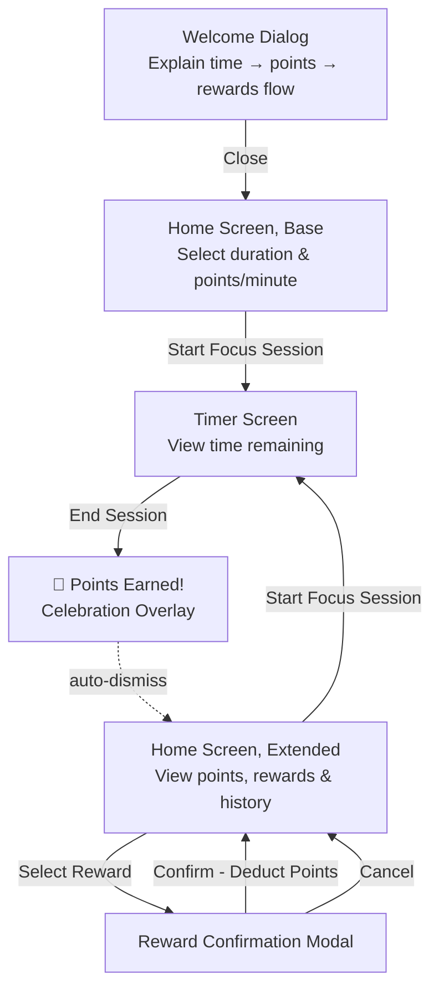

# PomoExchange Design Document

## 1. Executive Summary

PomoExchange addresses the challenge of sustaining focus in a world with increasing distractions. Existing time management tools focus on tracking time blocks, but few provide immediate, tangible rewards for maintaining focus. This creates a gap between the traditional Pomodoro technique (25-minute focus + 5-minute break) and user motivation.

Unlike passive time-tracking apps, PomoExchange replaces the mandatory break structure and gamifies time blocking with optional earned rewards to turn passive breaks into earned reward activities. Users stay focused to earn points, which they can redeem for reward activities like quick walks or stretches.

PomoExchange intentionally defaults to a tighter focus-to-reward ratio than traditional Pomodoro (4:1 vs 3.33:1), encouraging more time spent focusing while providing flexibility on when to take breaks. Rather than mandating breaks, users choose when and how to spend their earned reward time.

## 2. Requirements & Goals

### 2.1 Functional Requirements

1. Onboarding
   - Explanation of app is the first thing user sees

2. Focus Session Management
   - User can begin and end a focus session
   - User can set the length of time for the focus session
   - User can end a focus session at any time (early or at completion)
   - Points are based purely on elapsed time — no penalty for ending early, no bonus for completing
   - This gives users flexibility for real-world interruptions without creating pressure to optimize around the timer

3. Points Calculation
  - User receives points when ending a focus session
  - Points formula: `points = elapsedMinutes * (pointsNumerator / pointsDenominator)`
  - Default: `pointsNumerator = 1`, `pointsDenominator = 20` (yields 0.05 points/minute)
  - User sets points per minute via two integer-only numeric inputs: numerator and denominator (pointsPerMinute = numerator / denominator)
   - `pointsNumerator` min=1, max=3
   - `pointsDenominator` min=1, max=75
  - `pointsNumerator` and `pointsDenominator` settings persist across focus sessions within the same app session
  - Points are capped at 10,000
  - If earning points would exceed the cap, the user receives points only up to 10,000
  - User is notified before starting a focus session when at cap

4. Reward System
   - Three predefined reward tiers:
   - Small: 5 minutes (suggestions: Stretching, Get a snack, Walk around)
   - Medium: 10 minutes (suggestions: Walk outside, Quick workout, YouTube video)
   - Large: 15 minutes (suggestions: Watching half a TV show, Quick nap)
   - Each tier displays suggested duration and example activities
   - User self-selects how to reward themselves within the chosen tier
   - Reward costs:
      - Small: 1 point (20 min focus at default rate)
      - Medium: 2 points (40 min focus at default rate)
      - Large: 3 points (60 min focus at default rate)
   - User can redeem a reward using earned points
   - Unaffordable rewards are disabled/grayed out with insufficient points message
   - Focus session history for the current app session is viewable through Home Screen after first focus session
   - Reward history for the current app session is visible on Home Screen after first reward redemption

5. Intentionally default to a 4:1 focus-to-reward ratio to encourage more time spent focusing than traditional Pomodoro. Comparisons are normalized to 100 minutes of focus (equivalent to 4 traditional Pomodoros):
   - Traditional Pomodoro: 4 × 25 min = 100 min focus. Breaks = 3 × 5 min short + 1 long break (15–30 min) = 30–45 min total break → ratio 3.33:1 to 2.22:1
   - PomoExchange: 100 min focus × 0.05 pts/min = 5 points = 25 min total reward time → ratio 4:1
   
   | Approach | Focus | Break | Ratio |
   |----------|-------|-------|-------|
   | Traditional Pomodoro (15-min long break) | 100 min | 30 min | 3.33:1 |
   | Traditional Pomodoro (30-min long break) | 100 min | 45 min | 2.22:1 |
   | PomoExchange | 100 min | 25 min | 4:1 |


### 2.2 Non-Functional Requirements

1. User Experience
   - UI should be minimal to prevent distractions during focus session
   - Animations should guide user through key actions
   - Timer should display time remaining during focus session
   - Accessibility: All interactive components meet WCAG 2.1 AA standards, validated via automated tests with no snapshot testing (Section 7.2)

2. Data Persistence
   - All state is lost on page close/reload

3. Motivation & Engagement
   - Reward history motivates users by visually displaying redeemed rewards
   - Focus session history provides transparency into user progress
   - Points system creates tangible incentive for focus

### 2.3 Goals

1. Gamify time blocking by replacing passive breaks with point-earned rewards
2. Create immediate, tangible rewards for maintaining focus
3. Bridge the gap between traditional Pomodoro technique and user motivation
4. Encourage sustained focus through tangible, self-selected reward incentives

### 2.4 Non-Goals
1. No user accounts or authentication — no login, no profiles, no multi-user support
2. No persistent storage — all state is scoped to a single browser session; no localStorage or server-side storage
3. No social features — no sharing, leaderboards, or community challenges
4. No custom rewards — reward tiers (Small, Medium, Large) are predefined and not user-configurable
5. No calendar integrations — no syncing with Google Calendar, Outlook, or other scheduling tools
6. No push notifications or reminders — the app does not prompt users to start sessions
7. No analytics or progress tracking across sessions — no dashboards, reports, or trend visualization
8. No offline support beyond a loaded page — the app requires an initial page load and internet connection

### 2.5 Definitions
1. App Session: The period from when a user loads the page in their browser until they close the tab or navigate away. All history (focus sessions and rewards) is scoped to a single app session and is lost when the session ends.

## 3. User Flow & Design Constraints

### 3.1 User Flow



#### Notes
| Category | Details |
|----------|---------|
| **State** | All state lost on page close/reload. Points deducted on redemption. No backend storage. Client-side only. |
| **Welcome Dismissal** | Welcome dismissal is scoped to the current app session only. No cross-session persistence per Non-Goal #2. |
| **Screen States** | After the first focus session, the home screen expands to show points balance, reward catalog, and focus session history. Reward history appears after the first reward redemption. |
| **Rewards** | Rewards require points to redeem. Points deducted upon confirmation. Reward history updated after redemption. |
| **Affordability** | Checked at catalog display. Only affordable rewards selectable. No error screen needed. |
| **Reward History Bar** | Displayed inline on the home screen after first reward redemption as a row of tier-differentiated shapes. Hover (desktop) or tap (mobile) reveals redemption timestamp, tier, and points cost. Scoped to current app session only. |
| **Focus History List** | Focus session history for only the current app session. |
| **History Sections** | Reward History Bar and Focus History List are inline sections of the Home Extended screen, not separate navigable views or pages. |
| **Reward Confirmation** | Triggered when selecting an affordable reward from the inline reward catalog. Implemented as a confirmation modal overlay on the home screen. Confirming deducts points and returns to the home screen; canceling closes the modal with no changes. |
| **Points Cap Warning** | Persistent inline warning displayed near the "Start Focus Session" button on Home Screen (Base/Extended) when `pointsBalance >= POINTS_CAP`. No dismiss option; hidden automatically when points drop below `POINTS_CAP` (via reward redemption). Informs user they will earn 0 points for focus sessions while at cap. |
| **Navigation Away** | Navigating away from `/timer` during an active session (browser back/forward, manual URL change within the app) ends the session and awards points based on elapsed time, identical to the End Session button. No confirmation dialog. |
| **Points Celebration Overlay** | Center-screen congratulations card over a full-screen backdrop. Shows points earned with a celebratory animation (points counter + confetti). Auto-dismisses after ~3 seconds, revealing Home Extended. |

### 3.2 State Management
- All state held in memory (§4.4)
- Lost on page close/reload — no persistence (localStorage, cookies, or server)

### 3.3 Design Constraints

**Architecture**
- Active focus session ends when user navigates away from the timer screen; points calculated identically to manual end

**Platform & Browser Support**
- Target: modern Chromium, Firefox, WebKit (Safari) — latest major version
- No legacy browser support (IE11, older Safari)

**Device & Responsiveness**
- Primary target: mobile (iPhone 12 viewport: 390×844)
- Responsive: single-column mobile layout → multi-column on wider screens
- Touch targets ≥44×44px per WCAG 2.1 AA

**Accessibility**
- WCAG 2.1 AA for all interactive components
- Validated via automated accessibility testing (§7.2)

**Testing Constraints**
- Tests written alongside implementation (§6.1)
- ~80% Tier 3 branch coverage; 100% user flow path coverage (§7.3)

## 4. Detailed Design

### 4.1 Screen Hierarchy

The app has two screens: **Home** and **Timer**.

**Home screen** contains:
- Onboarding explanation (shown on first load only of each app session)
- Session configuration (duration, points per minute, start action)
- Points display (hidden until first session)
- Reward catalog (three predefined tiers: Small / Medium / Large)
- Reward history bar (hidden until first redemption)
- Focus history list (hidden until first session)

**Timer screen** contains:
- Time remaining display with progress indicator
- End session action
- Redirects to Home when no active session; ending session on navigation away

### 4.2 Screen Section Responsibilities

| Section | Responsibility |
|---------|---------------|
| Onboarding explanation | Explains time→points→rewards flow. Shown once per app session; resets on reload. |
| Session configuration | Duration input, points numerator/denominator, start action, cap warning. Disabled during active session. |
| Points display | Shows current point balance. Hidden until first session. |
| Focus history | Expandable list of completed sessions for current app session; collapsed by default. Each entry shows elapsed minutes and points earned. |
| Reward history bar | Inline row of tier-differentiated shapes. Hidden until first redemption. Hover/tap reveals timestamp, tier, cost. Scoped to current session only. |
| Reward catalog | Lists three tiers with duration, cost, and example activities. Unaffordable rewards are disabled with "Need X more points" message. Selecting an affordable reward shows a confirmation step before deducting points. |
| Timer | Countdown timer with progress indicator. End action triggers points calculation. |
| Points celebration | Full-screen overlay showing points earned with celebratory animation. Auto-dismisses after a brief timeout. |

### 4.3 Data Concepts

**FocusSession**: elapsed minutes, points earned, timestamp

**RewardRedemption**: tier redeemed, points cost, timestamp

**App state**:
- points balance
- list of past focus sessions
- list of past reward redemptions
- last session's points earned (cleared after celebration dismissed)
- whether a focus session is currently active, with its start time
- session configuration: duration minutes, points numerator, points denominator
- whether the welcome onboarding has been dismissed this app session

**Constants**:
- Points cap: 10,000
- Default points rate: 1/20 per minute (numerator=1, denominator=20)
- Numerator range: 1–3
- Denominator range: 1–75
- Three reward tiers:

| Tier | Duration | Cost (points) | Example suggestions |
|------|----------|---------------|--------------------|
| Small | 5 min | 1 | Stretching, Get a snack, Walk around |
| Medium | 10 min | 2 | Walk outside, Quick workout, YouTube video |
| Large | 15 min | 3 | Watching half a TV show, Quick nap |

### 4.4 State Transitions

All state is held in memory and lost on page close/reload.

| Trigger | Effect |
|---------|--------|
| Dismiss welcome | Welcome no longer shown for remainder of app session |
| Change duration | Duration updated; ignored during active session |
| Change numerator | Points numerator updated; ignored during active session |
| Change denominator | Points denominator updated; ignored during active session |
| Start session | Session becomes active; start time recorded |
| End session | Points calculated from elapsed time (capped at 10,000 total balance), added to balance; session appended to history; session deactivated |
| Redeem reward | Points deducted if balance ≥ cost; redemption appended to history |
| Dismiss celebration | Clears last session points earned |

### 4.5 Screen Layouts

| Screen | Key Elements | Notes |
|--------|-------------|-------|
| Home (Base) | Duration input, points numerator/denominator, start action, cap warning | Shown before first session |
| Home (Extended) | Points balance, reward catalog, reward history bar, collapsible focus history | After first session |
| Timer | Full-screen, MM:SS countdown, progress indicator, end action | Redirects to Home when no active session |
| Points celebration | Full-screen backdrop, centered card with point total and congratulations | Overlaid on Home Extended; auto-dismisses |

### 4.6 Key Algorithms

**Points calculation:**
```
pointsPerMinute = numerator / denominator
pointsEarned = min(elapsedMinutes × pointsPerMinute, POINTS_CAP − currentBalance)
```
- No bonus for completing full duration
- No penalty for ending early
- Capped at 10,000 total points
- Maximum 3 points per minute (enforced by numerator ≤ 3 and denominator ≥ 1)

**Reward affordability check:**
```
isAffordable = currentBalance >= tierCost
```
- Unaffordable rewards are disabled with "Need X more points" message

### 4.7 Navigation

| View | Behavior |
|------|----------|
| Home | Default view; shows onboarding on first load of each app session |
| Timer | Active focus session only; navigating here when no session is active redirects to Home; navigating away from Timer during a session ends the session |

## 5. Alternatives Considered
I evaluated the following alternatives to the chosen design and technical decisions, weighing tradeoffs against the project's stated goals (Section 2.3) and non-goals (Section 2.4).

### 5.1 Technical Stack Alternatives
| Decision Area | Alternative | Pros | Cons | Requirement Satisfied |
|---------------|-------------|------|------|-----------------------|
| State Management | Zustand / Redux Toolkit | Scalable for large apps, built-in devtools | Overkill for small client-only state scope, adds external dependencies | Context + useReducer satisfies client-only state management with no external dependencies |
| CSS Framework | CSS Modules / styled-components | Scoped styles, no utility class learning curve | More boilerplate for responsive design, less consistent cross-component styling | Utility-first CSS satisfies rapid, consistent responsive design |
| Build Tool | Create React App (CRA) | Familiar to many React developers | Deprecated, no longer maintained, slower HMR than Vite | Vite satisfies fast iterative development with modern ESM support |
| Deployment | Vercel / Netlify | Built-in CI/CD, additional deployment features | Requires account setup, GitHub Pages meets all static hosting needs | GitHub Pages satisfies free static hosting integrated with the repo |

### 5.2 Product Design Alternatives
| Decision Area | Alternative | Pros | Cons | Rejected Because |
|---------------|-------------|------|------|------------------|
| State Persistence | localStorage for cross-session history | Users retain progress across page reloads/closes | Triggers privacy compliance requirements for persistent client-side storage, violates Non-Goal #2 (no persistent storage), adds session cleanup complexity | Avoids privacy compliance overhead; all state is explicitly scoped to a single app session |
| Reward Structure | User-customizable reward tiers | More personalization for end users | Violates Non-Goal #4, adds UI complexity for custom tier creation; without cross-session state persistence, users lose custom rewards on page reload and must re-specify them each app session | Predefined tiers simplify onboarding, align with "immediate tangible rewards" goal, and avoid forcing users to re-enter custom rewards every app session due to no persistent storage |
| Points System | Bonus points for full session completion, penalty for early end | Encourages completing 25-minute blocks | Creates timer optimization pressure, violates FR2 (flexibility for interruptions) | Linear points system prioritizes user flexibility over rigid session rules |
| Focus-to-Reward Ratio | Traditional Pomodoro 3.33:1 (100min focus / 30min break for 4 Pomodoros including long break) | Familiar to existing Pomodoro users | Passive mandatory breaks instead of earned rewards, less incentive for sustained focus | Project goal is to encourage longer focus sessions via 4:1 earned reward ratio |
| Authentication | Optional user accounts for cross-device sync | Cross-device progress tracking | Violates Non-Goal #1, requires backend/storage infrastructure | App is explicitly client-only with no backend or user accounts |
| Reward Redemption | No points deduction (unlimited redemptions) | Higher initial user engagement | Breaks earn-spend gamification loop, no incentive to earn more points | Points deduction is critical to the core gamification value proposition |

## 6. Architecture & Code Organization

### 6.1 Technology Stack
| Requirement | Spec |
|-------------|------|
| Static typing | Must prevent common runtime errors and improve developer experience |
| UI rendering | Must support component-based architecture with client-side navigation |
| Styling | Must support responsive, accessible UI with minimal visual overhead during focus sessions |
| Testing | Must support automated E2E flows and WCAG validation in a real browser |
| Accessibility | All interactive components must meet WCAG 2.1 AA standards |
| Deployment | Must deploy as a static site with no server-side runtime |

### 6.4 Navigation
- Home view (default) and Timer view
- Timer redirects to Home when no active session
- Navigation away from Timer during active session triggers session end (§4.7)

### 6.5 Testing Requirements
| Tier | Behaviour to Cover | Coverage Target |
|------|--------------------|-----------------|
| Tier 1 | Static presentational output, no logic or interactions | Not tested |
| Tier 2 | Renders data from props, read-only display | Tested via integration with parent |
| Tier 3 | Business logic, user interactions, state transitions, conditional rendering, calculations | ~80% branch coverage |
- All user flow logic paths (§3.1): 100% coverage
- Each behavior is tested exactly once

## 7. Testing

This section defines the testing strategy, scope, and validation criteria for PomoExchange, aligning with the project's Functional Requirements (Section 2.1) and Non-Functional Requirements (Section 2.2).

### 7.1 Testing Scope

| Tier | Criteria | Testing Approach | Examples |
|------|----------|------------------|----------|
| **Tier 1: Pure Presentational** | No logic, no interactions, no state | **No tests** | Static divs, simple icons |
| **Tier 2: Data Display** | Renders prop data, no interactions | **Integration only** | Display-only components |
| **Tier 3: Business Logic** | User interactions, conditional rendering, calculations, route protection | **Full testing** (unit + component + integration) | Reducer, interactive components |

**Coverage impact**: Only Tier 3 code counts toward ~80% coverage target. Tier 1/2 excluded.

**State Reset Tests**: Explicitly excluded (Non-Goal #2). All state resets on reload by design.

**Timer drift** (background tab, system sleep, setInterval) explicitly excluded.

### 7.2 Test Scope Requirements

Test coverage must cover:
- **Pure logic**: Reducer, calculations, affordability checks — no rendering
- **Interactive UI components**: Components with business logic — isolated with mocked dependencies
- **Multi-component flows**: Full app state
- **Full user journey**: Welcome through reward redemption — no mocks except timer

Must work correctly across modern browsers. All interactive components must meet WCAG 2.1 AA standards. Tests must produce deterministic, repeatable results regardless of wall-clock timing. Must be usable on modern mobile devices and meet WCAG 2.1 AA touch target requirements.

### 7.3 Coverage Requirements

**Tier 3 Branch Coverage (~80%)** — all decision point branches:
- Welcome Dialog: shown vs dismissed
- End Session: early vs full duration
- Points: under cap vs hits/exceeds cap
- Reward: affordable vs unaffordable
- Protected Route: active session vs redirect
- Points Celebration: shown vs dismissed

**User Flow Logic Path Coverage (100%)** — 9 enumerated paths in Section 3.1:
1. Welcome → HomeBase (initial load → dismiss → Home Screen Base)
2. HomeBase → Timer (start focus session → active Timer Screen)
3. Timer → EndSession (end session → calculate points)
4. EndSession → PointsCelebration → (auto-dismiss) → HomeExtended (points earned → Home Screen Extended)
5. HomeExtended → Timer (start new session → repeat flow)
6. HomeExtended → Reward Redemption → Confirm (select reward → confirm → return)
7. HomeExtended → Reward Redemption → Cancel (select reward → cancel → stay on HomeExtended)
8. Protected Route Redirect (direct `/timer` URL → redirect to `/`)
9. Points Cap Warning (`pointsBalance >= POINTS_CAP` → show inline warning)

**E2E Journey Coverage (100%)** — Single test validating full flow:
1. Welcome → dismiss → HomeBase
2. Start focus session → TimerScreen
3. End session → PointsCelebration overlay → auto-dismiss → HomeExtended
4. Redeem reward → confirm → points deducted
5. Repeat partial flow to verify state persistence

**Exclusions**: Third-party deps, type definitions, Tier 1/2 components.
