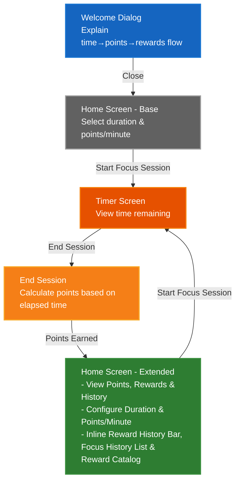

# PomoExchange Design Document

## 1. Executive Summary

PomoExchange addresses the challenge of sustaining focus in a world with increasing distractions. Existing time management tools focus on tracking time blocks, but few provide immediate, tangible rewards for maintaining focus. This creates a gap between the traditional Pomodoro technique (25-minute focus + 5-minute break) and user motivation.

Unlike passive time-tracking apps, PomoExchange replaces the mandatory break structure and gamifies time blocking with optional earned rewards to turn passive breaks into earned reward activities. Users stay focused to earn points, which they can redeem for reward activities like quick walks or stretches.

PomoExchange intentionally defaults to a tighter focus-to-reward ratio than traditional Pomodoro (4:1 vs 3.33:1), encouraging sustained focus beyond the standard 25-minute blocks. Rather than mandating breaks, users choose when and how to spend their earned reward time.

## 2. Requirements & Goals

### 2.1 Functional Requirements

1. Onboarding
   - Explanation of app is the first thing user sees

2. Focus Session Management
   - User can begin and end a focus session
   - User can set the length of time for the focus session
   - User can end a focus session at any time (early or at completion)
   - Points are based purely on elapsed time — no penalty for ending early, no bonus for completing
   - This gives users flexibility for real-world interruptions without creating pressure to optimize around the timer

3. Points Calculation
   - User receives points when ending a focus session
   - Points formula: `points = elapsedMinutes * pointsPerMinute`
   - Default pointsPerMinute = 0.05
   - User can set the number of points earned per minute elapsed
   - The pointsPerMinute setting persists across focus sessions within the same app session
   - Points are capped at 10,000
   - If earning points would exceed the cap, the user receives points only up to 10,000
   - User is notified before starting a focus session when at cap

4. Reward System
   - Three predefined reward tiers:
     - Small: 5 minutes (suggestions: stretching, getting a snack, getting up and walking around)
     - Medium: 10 minutes (suggestions: walking outside, a quick workout, a short YouTube video)
     - Large: 15 minutes (suggestions: watching half a TV show, a quick nap)
   - Each tier displays suggested duration and example activities
   - User self-selects how to reward themselves within the chosen tier
   - Reward costs:
      - Small: 1 point (20 min focus at default rate)
      - Medium: 2 points (40 min focus at default rate)
      - Large: 3 points (60 min focus at default rate)
   - User can redeem a reward using earned points
   - Unaffordable rewards are disabled/grayed out with insufficient points message
   - Focus session history for the current app session is viewable through Home Screen after first focus session
   - Reward history for the current app session is visible on Home Screen after first reward redemption

5. Intentionally default to a 4:1 focus-to-reward ratio to encourage sustained focus beyond traditional Pomodoro. Comparisons are normalized to 100 minutes of focus (equivalent to 4 traditional Pomodoros):
   - Traditional Pomodoro: 4 × 25 min = 100 min focus. Breaks = 3 × 5 min short + 1 long break (15–30 min) = 30–45 min total break → ratio 3.33:1 to 2.22:1
   - PomoExchange: 100 min focus × 0.05 pts/min = 5 points = 25 min total reward time → ratio 4:1
   
   | Approach | Focus | Break | Ratio |
   |----------|-------|-------|-------|
   | Traditional Pomodoro (15-min long break) | 100 min | 30 min | 3.33:1 |
   | Traditional Pomodoro (30-min long break) | 100 min | 45 min | 2.22:1 |
   | PomoExchange | 100 min | 25 min | 4:1 |


### 2.2 Non-Functional Requirements

1. User Experience
   - UI should be minimal to prevent distractions during focus session
   - Animations should guide user through key actions
   - Timer should display time remaining during focus session

2. Data Persistence
   - All state is lost on page close/reload

3. Motivation & Engagement
   - Reward history motivates users by visually displaying redeemed rewards
   - Focus session history provides transparency into user progress
   - Points system creates tangible incentive for focus

### 2.3 Goals

1. Gamify time blocking by replacing passive breaks with point-earned rewards
2. Create immediate, tangible rewards for maintaining focus
3. Bridge the gap between traditional Pomodoro technique and user motivation
4. Encourage sustained focus through tangible, self-selected reward incentives

### 2.4 Non-Goals
1. No user accounts or authentication — no login, no profiles, no multi-user support
2. No persistent storage — all state is scoped to a single browser session; no localStorage or server-side storage
3. No social features — no sharing, leaderboards, or community challenges
4. No custom rewards — reward tiers (Small, Medium, Large) are predefined and not user-configurable
5. No calendar integrations — no syncing with Google Calendar, Outlook, or other scheduling tools
6. No push notifications or reminders — the app does not prompt users to start sessions
7. No analytics or progress tracking across sessions — no dashboards, reports, or trend visualization
8. No offline support beyond a loaded page — the app requires an initial page load and internet connection

### 2.5 Definitions
1. App Session: The period from when a user loads the page in their browser until they close the tab or navigate away. All history (focus sessions and rewards) is scoped to a single app session and is lost when the session ends.

## 3. Architecture Overview

### 3.1 User Flow



#### Notes
| Category | Details |
|----------|---------|
| **State** | All state lost on page close/reload<br/>Points deducted on redemption<br/>No backend storage<br/>Client-side only |
| **Welcome Dismissal** | WelcomeDialog dismissal is scoped to the current app session only; no cross-session persistence per Non-Goal #2. |
| **Screen States** | HomeExtended includes all HomeBase functionality (duration and pointsPerMinute configuration) plus points display, reward catalog, and focus session history; reward history appears conditionally after the first reward redemption<br/>Home screen transitions from Base to Extended after first focus session |
| **Rewards** | Rewards require points to redeem<br/>Points deducted upon confirmation<br/>Reward history updated after redemption |
| **Affordability** | Checked at catalog display<br/>Only affordable rewards selectable<br/>No error screen needed |
| **Reward History Bar** | Displayed inline on Extended Home after first reward redemption as a row of tier-differentiated shapes: Small=triangle, Medium=square, Large=pentagon. Hover (desktop) or tap (mobile) reveals redemption timestamp, tier, and points cost. Scoped to current app session only. |
| **Focus History List** | Focus session history for only the current app session |
| **History Sections** | Reward History Bar and Focus History List are inline sections of the Home Extended screen, not separate navigable views or pages. |
| **Reward Confirmation** | Triggered when selecting an affordable reward from the inline Reward Catalog. Implemented as `RewardConfirmationModal` (modal overlay on Home Screen), not a separate screen. Confirming deducts points and returns to Home Extended. |
| **Points Cap Warning** | Persistent inline warning displayed near the "Start Focus Session" button on Home Screen (Base/Extended) when `pointsBalance >= 10000`. No dismiss option; hidden automatically when points drop below 10k (via reward redemption). Informs user they will earn 0 points for focus sessions while at cap. |
| **Route Guards** | `/timer` route is protected by `ProtectedRoute` wrapper. If user navigates to `/timer` when `!isSessionActive` (e.g., direct URL access, page reload), they are automatically redirected to `/` (Home Screen). |

### 3.2 Technical Stack

| Component | Technology | Version | Rationale |
|-----------|------------|---------|-----------|
| Frontend Framework | React | TBD | Latest stable with full TypeScript support |
| Routing | React Router | TBD | Declarative routing with type safety |
| State Management | Context + useReducer | TBD | Global state for points/focus sessions without external dependencies |
| Build Tool | Vite | TBD | Fast HMR, optimized for React |
| CSS Framework | Tailwind CSS | TBD | Utility-first, consistent styling |
| Language | TypeScript | TBD | Type safety, better IDE support |
| Testing | Vitest (Browser Mode) | TBD | Fast, ESM-first, runs tests in real browsers via `npx vitest init browser` |
| Deployment | GitHub Pages | - | Static hosting, free |

### 3.3 State Management Strategy
- Client-Only Application: All state is managed client-side without server storage
- Session State: User-configured minutes for focus session, active session start time (for elapsed time calculation), points balance, points earned per minute (persists within the current app session), reward history (for current app session only), focus session history (for current app session only)
- No backend storage

### 3.4 Design Constraints
- Client-Only Application: No backend, no API calls
- No Authentication: No user accounts, no login required
- No Server-Side Validation: All validation is client-side

## 4. Detailed Design

### 4.1 Component Hierarchy

```
App
├── HomeScreen
│   ├── WelcomeDialog (conditional: shown on initial page load of each app session per Section 2.5)
│   ├── SessionConfig (duration input, points/minute selector)
│   ├── PointsDisplay
│   ├── FocusHistorySection
│   │   ├── FocusHistoryHeader (expand/collapse toggle)
│   │   └── FocusHistoryList (collapsible)
│   │       └── FocusSessionItem
│   ├── RewardHistoryBar
│   │   └── RewardShape
│   └── RewardCatalog
│       ├── RewardTierCard (Small, Medium, Large)
│       └── RewardConfirmationModal
└── ProtectedRoute
    └── TimerScreen
        ├── TimerDisplay
        └── EndSessionButton
```

### 4.2 Component Responsibilities

| Component | Responsibility |
|-----------|---------------|
| `WelcomeDialog` | Shown once per app session (on initial page load of each app session per Section 2.5); explains time → points → rewards flow. Resets to un-dismissed on page reload/navigation away per Section 2.2 NFR #2 (no persistent storage). |
| `SessionConfig` | Duration input (minutes) and points/minute slider/input; disabled during active session. Contains "Start Focus Session" button. Conditionally renders a persistent inline cap warning near the Start button when `state.pointsBalance >= 10000`: *"You've reached the 10,000 points cap! Focus sessions will earn 0 points until you redeem rewards."* |
| `PointsDisplay` | Shows current point balance; hidden until first session completed |
| `FocusHistorySection` | Expandable section for focus history; collapsed by default |
| `FocusHistoryHeader` | Shows section title and expand/collapse toggle |
| `FocusHistoryList` | Renders list of completed focus sessions for current app session; hidden when collapsed |
| `FocusSessionItem` | Single session entry showing elapsed minutes and points earned |
| `RewardHistoryBar` | Inline row of tier-differentiated shapes; hidden until first redemption |
| `RewardShape` | Triangle/square/pentagon; hover/tap reveals timestamp, tier, cost |
| `RewardCatalog` | Lists three tiers; disables unaffordable rewards |
| `RewardTierCard` | Displays tier name, duration, cost, example activities |
| `RewardConfirmationModal` | Shows cost and asks for confirmation before deducting points |
| `TimerScreen` | Displays countdown timer; handles session end |
| `TimerDisplay` | Large time-remaining display with visual progress indicator |
| `EndSessionButton` | Ends session early or at completion; triggers points calculation |
| `ProtectedRoute` | Wrapper component that reads `isSessionActive` from `AppStateContext`. If `true`, renders child component (`TimerScreen`). If `false`, redirects to `/` (Home Screen) via React Router `Navigate` component. |

### 4.3 Data Types

```typescript
type RewardTier = 'small' | 'medium' | 'large';

interface FocusSession {
  id: string;
  elapsedMinutes: number;
  pointsEarned: number;
  endedAt: Date;
}

interface RewardRedemption {
  id: string;
  tier: RewardTier;
  pointsCost: number;
  redeemedAt: Date;
}

interface AppState {
  pointsBalance: number;
  focusSessions: FocusSession[];
  rewardHistory: RewardRedemption[];
  isSessionActive: boolean;
  sessionStartTime: Date | null;
  sessionConfig: {
    durationMinutes: number;
    pointsPerMinute: number;
  };
  welcomeDismissed: boolean;
}

const POINTS_CAP = 10000;
const DEFAULT_POINTS_PER_MINUTE = 0.05;

const REWARD_TIERS = {
  small:  { duration: 5,  cost: 1, suggestions: ['Stretching', 'Get a snack', 'Walk around'] },
  medium: { duration: 10, cost: 2, suggestions: ['Walk outside', 'Quick workout', 'YouTube video'] },
  large:  { duration: 15, cost: 3, suggestions: ['Watching half a TV show', 'Quick nap'] },
} as const;
```

### 4.4 State Management

**Context structure:**

```typescript
interface AppStateContextValue {
  state: AppState;
  dispatch: React.Dispatch<AppAction>;
}

type AppAction =
  | { type: 'DISMISS_WELCOME' }
  | { type: 'SET_DURATION'; payload: number }
  | { type: 'SET_POINTS_PER_MINUTE'; payload: number }
  | { type: 'START_SESSION' }
  | { type: 'END_SESSION' }
  | { type: 'REDEEM_REWARD'; payload: { tier: RewardTier } };
```

**Initial state:**

```typescript
const initialState: AppState = {
  pointsBalance: 0,
  focusSessions: [],
  rewardHistory: [],
  isSessionActive: false,
  sessionStartTime: null,
  sessionConfig: {
    durationMinutes: 25,
    pointsPerMinute: 0.05,
  },
  welcomeDismissed: false,
};
```

**Reducer cases:**
- `DISMISS_WELCOME`: Sets `welcomeDismissed: true` for the current app session; resets to false on page reload (new app session) due to no persistent storage (Section 2.4 Non-Goal #2).
- `SET_DURATION`: Updates `sessionConfig.durationMinutes`; ignored if `isSessionActive: true`
- `SET_POINTS_PER_MINUTE`: Updates `sessionConfig.pointsPerMinute`; ignored if `isSessionActive: true`
- `START_SESSION`: Sets `isSessionActive: true`, `sessionStartTime: new Date()`
- `END_SESSION`: Calculates `elapsedMinutes` as (session end time - `sessionStartTime`) in minutes (retain fractional values). Calculates `pointsEarned` as `elapsedMinutes * state.sessionConfig.pointsPerMinute`, capped to ensure `state.pointsBalance + pointsEarned` does not exceed `POINTS_CAP` (10,000) per Section 2.1. Appends new `FocusSession` entry with `elapsedMinutes` set to the calculated value and `pointsEarned` set to the capped value. Sets `isSessionActive: false`, `sessionStartTime: null`. (Matches Section 4.6 algorithm)
- `REDEEM_REWARD`: Checks affordability, deducts points, appends to `rewardHistory`

### 4.5 Screen Layouts

**Home Screen (Base):**
- Centered vertically
- Duration input field
- Points/minute input
- "Start Focus Session" button
- Persistent inline points cap warning (displayed near Start Focus Session button when pointsBalance >= 10000)

**Home Screen (Extended):**
- Points balance at top
- Duration and points/minute config (same as Base)
- "Start Focus Session" button
- Persistent inline points cap warning (displayed near Start Focus Session button when pointsBalance >= 10000)
- Reward history bar (conditional, after first redemption)
- Reward catalog section (responsive: 3-column grid on desktop, single column on mobile; suggestions shown on tap on mobile)
- Focus history list at bottom (collapsible, collapsed by default): shows each session's elapsed minutes and points earned

**Timer Screen:**
- Full-screen layout
- Large countdown timer (MM:SS)
- Visual progress ring or bar
- "End Session" button

### 4.6 Key Algorithms

**Points calculation:**
```
pointsEarned = min(elapsedMinutes * state.sessionConfig.pointsPerMinute, POINTS_CAP - state.pointsBalance)
```
- No bonus for completing full duration
- No penalty for ending early
- Capped at 10,000 total points

**Reward affordability check:**
```
isAffordable = state.pointsBalance >= REWARD_TIERS[tier].cost
```
- Unaffordable rewards are grayed out with "Need X more points" message

### 4.7 Routing

| Route | Component | Notes |
|-------|-----------|-------|
| `/` | HomeScreen | Default route; shows WelcomeDialog on initial page load of each app session per Section 2.5; dismissed state resets on page reload per Section 2.2 NFR #2 |
| `/timer` | ProtectedRoute → TimerScreen | Active focus session only; wrapped with `ProtectedRoute` that redirects to `/` if `!isSessionActive` |

## 5. Alternatives Considered
I evaluated the following alternatives to the chosen design and technical decisions, weighing tradeoffs against the project's stated goals (Section 2.3) and non-goals (Section 2.4).

### 5.1 Technical Stack Alternatives
| Decision Area | Alternative | Pros | Cons | Rejected Because |
|---------------|-------------|------|------|------------------|
| State Management | Zustand / Redux Toolkit | Scalable for large apps, built-in devtools | Overkill for small client-only state scope, adds external dependencies | Context + useReducer handles points, sessions, and rewards with no third-party libraries |
| CSS Framework | CSS Modules / styled-components | Scoped styles, no utility class learning curve | More boilerplate for responsive design, less consistent cross-component styling | Tailwind's utility-first approach supports rapid, minimal UI development |
| Build Tool | Create React App (CRA) | Familiar to many React developers | Deprecated, no longer maintained, slower HMR than Vite | Vite offers faster development experience and better ESM support |
| Deployment | Vercel / Netlify | Built-in CI/CD, additional deployment features | Requires account setup, GitHub Pages meets all static hosting needs | No need for extra features, GitHub Pages is free and integrated with the repo |

### 5.2 Product Design Alternatives
| Decision Area | Alternative | Pros | Cons | Rejected Because |
|---------------|-------------|------|------|------------------|
| State Persistence | localStorage for cross-session history | Users retain progress across page reloads/closes | Triggers privacy compliance requirements for persistent client-side storage, violates Non-Goal #2 (no persistent storage), adds session cleanup complexity | Avoids privacy compliance overhead; all state is explicitly scoped to a single app session |
| Reward Structure | User-customizable reward tiers | More personalization for end users | Violates Non-Goal #4, adds UI complexity for custom tier creation; without cross-session state persistence, users lose custom rewards on page reload and must re-specify them each app session | Predefined tiers simplify onboarding, align with "immediate tangible rewards" goal, and avoid forcing users to re-enter custom rewards every app session due to no persistent storage |
| Points System | Bonus points for full session completion, penalty for early end | Encourages completing 25-minute blocks | Creates timer optimization pressure, violates FR2 (flexibility for interruptions) | Linear points system prioritizes user flexibility over rigid session rules |
| Focus-to-Reward Ratio | Traditional Pomodoro 3.33:1 (100min focus / 30min break for 4 Pomodoros including long break) | Familiar to existing Pomodoro users | Passive mandatory breaks instead of earned rewards, less incentive for sustained focus | Project goal is to encourage longer focus sessions via 4:1 earned reward ratio |
| Authentication | Optional user accounts for cross-device sync | Cross-device progress tracking | Violates Non-Goal #1, requires backend/storage infrastructure | App is explicitly client-only with no backend or user accounts |
| Reward Redemption | No points deduction (unlimited redemptions) | Higher initial user engagement | Breaks earn-spend gamification loop, no incentive to earn more points | Points deduction is critical to the core gamification value proposition |

## 6. Implementation Plan

### 6.1 TDD Approach
This plan follows Test-Driven Development (TDD) principles with a mandatory red-green-refactor cycle for all feature work:
1. **Red**: Write failing unit/component tests for the target functionality first
2. **Green**: Implement minimal code to make tests pass
3. **Refactor**: Clean up code while keeping tests passing
No batched testing phase: tests are written alongside corresponding feature code, not deferred to the end of the project.

### 6.2 Timeline & Milestones
| Milestone | Description | Estimated Duration | Dependencies |
|-----------|-------------|-------------------|--------------|
| M1: Project Scaffolding & Test Setup | Initialize React Router + TypeScript project (scaffolded via `create-react-router`, uses Vite under the hood), configure Tailwind CSS, set up Vitest browser mode, create base folder structure per Component Hierarchy (Section 4.1), define core types (Section 4.3) | 2-3 days | None |
| M2: Core Focus Session Logic (TDD) | Write tests first for state reducer, points calculation, session lifecycle; implement TimerScreen, SessionConfig, ProtectedRoute to pass tests | 4-5 days | M1 |
| M3: Points & Reward System (TDD) | Write tests first for reward redemption, affordability checks, history components; implement PointsDisplay, RewardCatalog, RewardHistoryBar, FocusHistorySection to pass tests | 4-5 days | M2 |
| M4: Onboarding & UI Polish (TDD) | Write tests first for WelcomeDialog, responsive layouts, animations; implement UI polish to pass tests | 3-4 days | M3 |
| M5: Deployment & Final QA | Run full test suite, configure GitHub Pages deployment, perform cross-browser/device QA, verify all requirements met | 2-3 days | M4 |

### 6.3 Build Phase Details
#### M1: Project Scaffolding & Test Setup
- Scaffold project with `npx create-react-router@latest` (select TypeScript and Vite options when prompted)
- Install dependencies: `tailwindcss`, `postcss`, `autoprefixer`
- Set up Vitest browser mode: Run `npx vitest init browser` (automatically installs `@vitest/browser`, Playwright browser provider, and configures `vitest.config.ts` for browser-mode testing)
- Define core types (`AppState`, `AppAction`, `FocusSession`, `RewardRedemption`) per Section 4.3, 4.4
- Create folder structure: `src/components/`, `src/context/`, `src/routes/`, `src/__tests__/`
- Write initial smoke tests to verify project setup (React renders, router works) using Vitest browser mode

#### M2: Core Focus Session Logic (TDD)
TDD cycle for each sub-task:
1. **Reducer & State Logic**
   - Red: Write failing tests for `AppStateContext` reducer cases: `START_SESSION`, `END_SESSION`, points calculation (Section 4.4, 4.6), points cap logic
   - Green: Implement reducer and context to pass all tests
   - Refactor: Optimize state logic if needed, keep tests passing
2. **Timer & Session Components**
   - Red: Write failing Vitest browser mode component tests for `TimerScreen`, `TimerDisplay`, `EndSessionButton`, `ProtectedRoute` (Section 4.1, 4.2, 4.7)
   - Green: Implement components to pass tests
   - Refactor: Clean up component code, keep tests passing
3. **Session Config**
   - Red: Write failing tests for `SessionConfig` input handling, points cap warning (Section 4.2, 4.5)
   - Green: Implement `SessionConfig` to pass tests
   - Refactor: Clean up as needed

#### M3: Points & Reward System (TDD)
TDD cycle for each sub-task:
1. **Points & History Display**
   - Red: Write failing Vitest browser mode tests for `PointsDisplay`, `FocusHistorySection`, `FocusSessionItem` (Section 4.2)
   - Green: Implement components to pass tests
   - Refactor: Clean up as needed
2. **Reward System**
   - Red: Write failing Vitest browser mode tests for `RewardCatalog`, `RewardTierCard`, affordability checks (Section 4.2, 4.6), `RewardConfirmationModal` points deduction
   - Green: Implement components to pass tests
   - Refactor: Clean up as needed
3. **Reward History**
   - Red: Write failing Vitest browser mode tests for `RewardHistoryBar`, `RewardShape` interactions (Section 4.2)
   - Green: Implement components to pass tests
   - Refactor: Clean up as needed

#### M4: Onboarding & UI Polish (TDD)
TDD cycle for each sub-task:
1. **Onboarding**
   - Red: Write failing Vitest browser mode tests for `WelcomeDialog` rendering, dismiss logic (Section 4.2)
   - Green: Implement `WelcomeDialog` to pass tests
   - Refactor: Clean up as needed
2. **Responsive & UI Polish**
   - Red: Write failing Vitest browser mode tests for responsive reward grid (Section 4.5), minimal animations, distraction-free `TimerScreen` (Section 2.2 NFR)
   - Green: Implement UI polish to pass tests
   - Refactor: Clean up as needed

#### M5: Deployment & Final QA
- Run full Vitest test suite, verify coverage ≥ 80% for reducer logic and core algorithms
- Configure GitHub Pages deployment via `vite.config.ts` base path
- Perform cross-browser/device QA (latest Chrome, Firefox, Safari desktop/mobile)
- Verify all Functional Requirements (Section 2.1) and Non-Functional Requirements (Section 2.2) are met
- No new test writing in this phase; only validate existing tests and deployment

### 6.4 Dependencies & Risks
- **TBD Tech Versions**: Finalize React, React Router, Tailwind, Vitest versions (marked TBD in Section 3.2) before M1 to avoid compatibility issues
- **No Backend**: All state is client-side only (Section 2.4 Non-Goal #2), no external state dependencies
- **Browser Compatibility**: Validate Tailwind, React, and Vitest browser mode features work on target browsers (latest version of major browsers)
- **TDD Adoption**: Strictly follow red-green-refactor cycle; avoid skipping tests for UI components

### 6.5 Success Criteria
- TDD red-green-refactor cycle followed for all feature milestones (M2-M4)
- All Functional Requirements (Section 2.1) implemented and verified via tests
- All Non-Functional Requirements (Section 2.2) met
- Vitest browser mode test coverage ≥ 80% for reducer logic, core algorithms, and critical components
- Successful production build with no console errors/warnings
- Public GitHub Pages deployment passes all QA checks
- No standalone testing phase; all tests written alongside corresponding feature code
